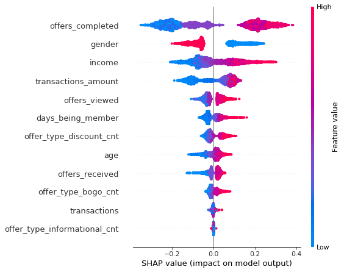

# DevFest_Women_2022

This repository is written for Dev Fest Women 2022, Almaty organized by Google Developers Group.

`persona_analysis_starbucks.ipynb`contains a persona analysis for Starbuck's dataset using k-means clustering and SHAP.

## Introduction

A user persona is a semi-fictional character based on your current (or ideal) customer. Personas can be created by talking to users and segmenting by various demographic and psychographic data to improve your product marketing. 

### Business problem

Starbucks' marketing team wants to conduct a campaign using previous campaign data. First, the marketing team wants to know how many user segments the user group have and what is the difference between the segments. After understanding each user segment and creating user personas, the marketing team wants to know how the new campaign can be successful and lead to a higher conversion rate and Gross Merchandise Sales (GMS).

### Task from your manager

Can you create user personas and understand what is the difference between them?

### Data

[Starbucks dataset](https://www.kaggle.com/datasets/ihormuliar/starbucks-customer-data): 
* `profile.csv` - dimensional data about each person, including their age, salary, and gender. There is one unique customer for each record
* `portfolio.csv` - information about the promotional offers that are possible to receive, and basic information about each one including the promotional type, duration of the promotion, reward, and how the promotion was distributed to customers
* `transcript.csv` - records show the different steps of promotional offers that a customer received. The different values of receiving a promotion are receiving, viewing, and completing. You also see the different transactions that a person made in the time since he became a customer. With all records, you see the day that they interacted with Starbucks and the amount that it is worth.

### Libraries needed:
* pandas
* numpy
* matplotlib
* seaborn
* warnings
* sklearn
* scipy
* shap

I used python 3.8 for running the code.

## Results & summary

* The Starbucks dataset contains 2-3 clusters. For the sake of simplicity, it was decided to divide the data into two segments
* Based on the SHAP plots, we can say that Starbucks may have **2 user personas**:
    - A female long-term customer with a yearly income of over 75,000 USD, who has done transactions over 150 USD. The user is over 45 y.o.
    - A male or other gender user, who has an income of less than 75 000 USD, and who has done transactions of less than 150 USD. The user is not younger than 45 y.o.
* By exploring user behavioural data and adding other demographical data such as location, we can improve our understanding of the user personas.
